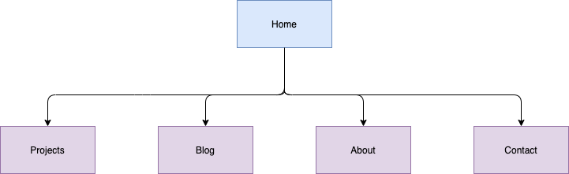
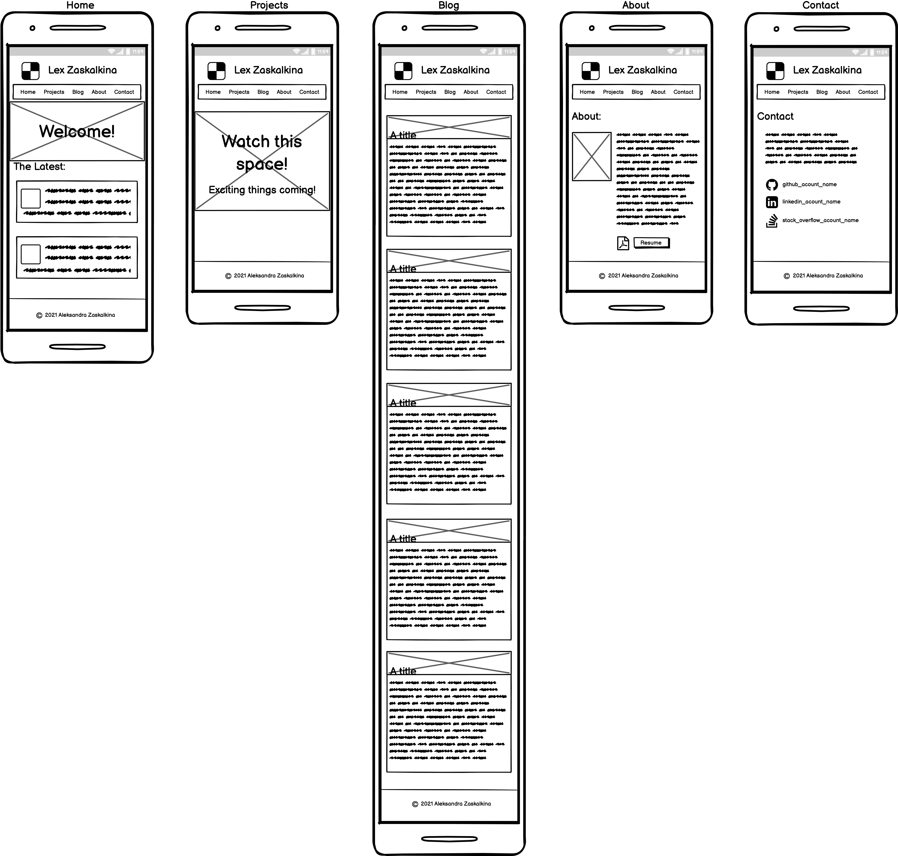
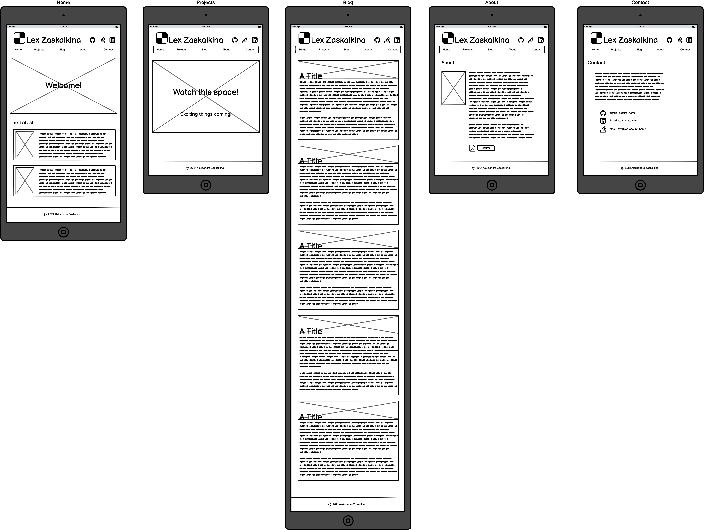
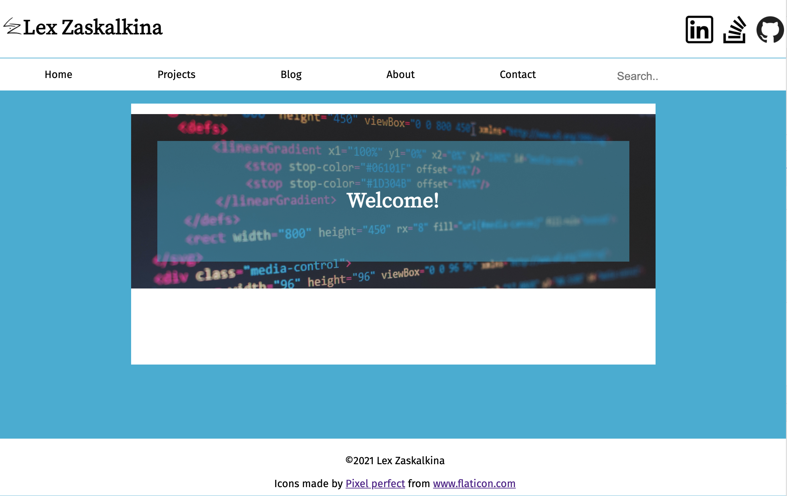
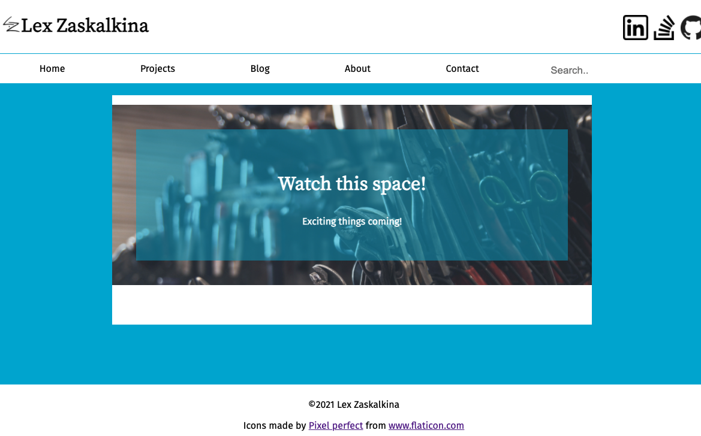
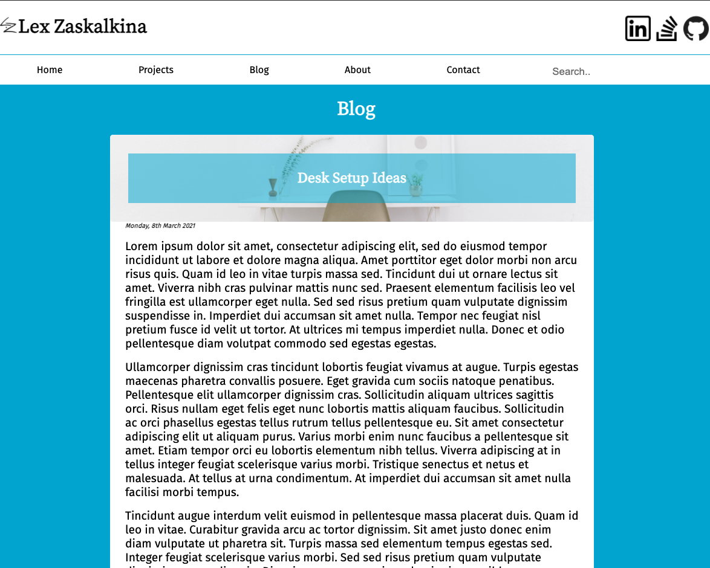
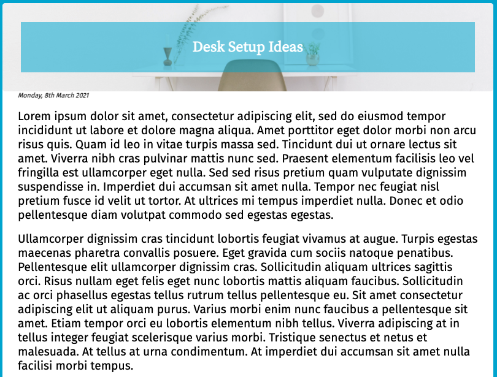
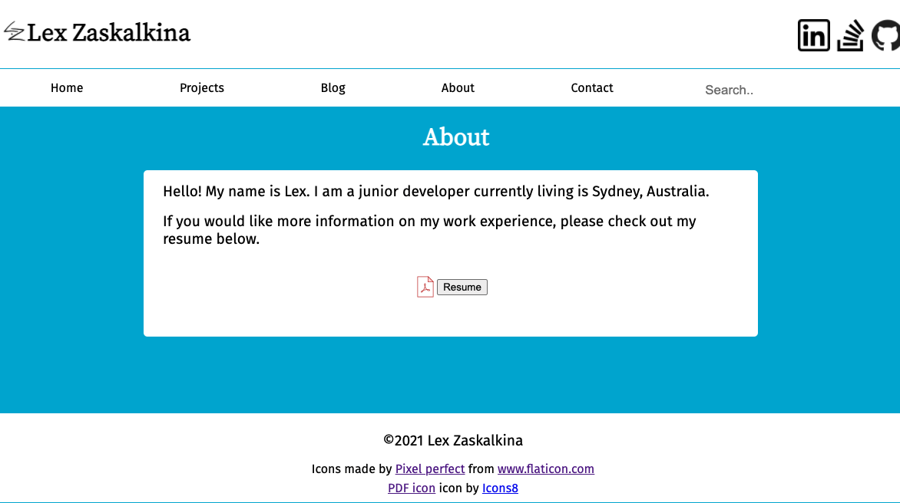
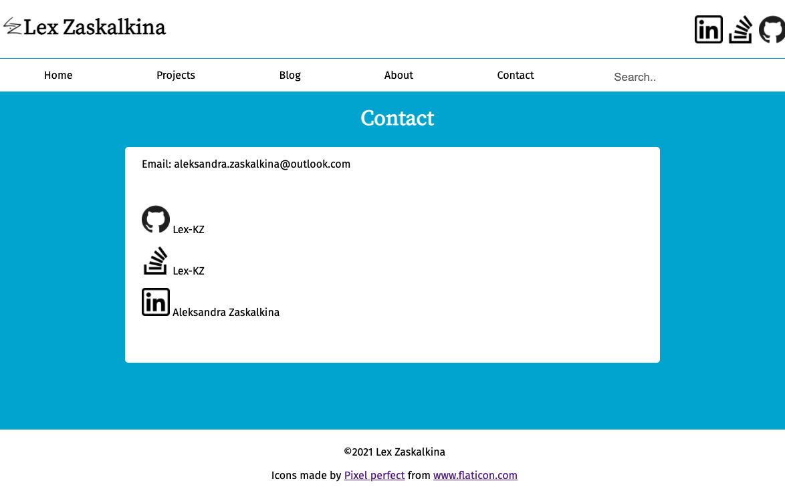

#Portfolio Website
[Portfolio Website](https://lex-kz.github.io/contact.html)
[Portfolio Ed Workspace](https://edstem.org/courses/4965/workspaces/py5gxNfFJL4ABhVxPvhgeJK48pMob5rg)
###Tech Stack:
- HTML
- CSS
- GitHub
- Balsamiq (Wire Frames)
- GitHub Pages (Deployment)
###Purpose:
The purpose of this website to present myself as a developer and IT professional. It showcases my skills, interests, and will be a place to showcase projects that I have created or participated in. 

**Target Audience:** Employers looking to hire a developer and/or IT professional. 

###Functionality/Features:

**Header:**

Within the header of each page is contained a logo, my preferred name, and links to three social media accounts(Linkedin, Stackoverflow, and GitHub) in the form of icons. The social media icons are only viewable on screens 600px in width or higher. This was done so that the header would be legible and aesthetically appealing on smaller screens. The social media links are also available on the Contact page.

**Navigation Bar:**

Bellow the header is located the navigation bar. It appears on all five HTML pages. It consists of links to all five HTML pages and a search bar. The search bar is not functional in it's current form as there is no database attached to the site. The search bar is also only viewable on screens 600px in width or higher so that users do not have to side scroll to view the whole navigation bar. A search bar is also available on the Home/Index page. 

**Footer**

The footer is located at the bottom of every page. In it, it contains copyright information for the site, as well as credit for the social media icons that are used in the header and on the Contact page. The footer of the about page also contains credit for the PDF icon used on that page. All future credit and copyright information will be placed in the footer with the exception of images used in blog posts.

**Home/Index Page:**

The Home page features a welcome message displayed over an image background. "Welcome" was originally  intended to be simply text over an image, but legibility issues stemming from single colour text on a multi-colour background led to the addition of a blue container overtop of the image but bellow the text. 

Bellow the welcome message is a search bar. The search bar was placed there so that mobile users will have access to the search bar.

**Projects Page**

The Projects page is very similar to the Home page. It displays a message to "watch this space" over an image with a blue container to aid with legibility.

**Blog Page**

The Blog page contains a tittle of "Blog", and five separate blog posts.

**Blog Posts**

Each blog post contains a header, a post date, a body, and tags. The header contains a title over a blue container and an image that relates to the post but is a stock image. If a post is directly referencing an image, that image would be part of the main body. The credit for the header images is placed at the bottom of the body. The post date is in small italic text under the header. The body is made up of several paragraphs of Lorem Ipsum text. The tags are currently a visual representation of the tagging system. The intention is for site visitors to use the search bars to search the site for relevant posts. 

**About Page**

The About page contains a title of "About", a brief introduction to me as a person, a PDF icon, and a link to a downloadable version of my Resume. The credit for the PDF icon is located in the footer of this page.

**Contact Page**

The Contact page contains a title of "Contact", my contact information and links to three social media accounts in the forms of clickable icons with the screen names listed. 

###Site Map

The Home/Index page is the first page a visitor would see and is the point of access for the rest of the site. The navigation bar at the top of each page links all pages to each other. 

###Wire Frames

**Phone View**

**iPad Views**

**Desktop View**
 

###Screenshots 

**Home page**

**Home page phone view**

**Projects page**

**Blog page**

**Blog Post**

**About page**

**Contact page**
